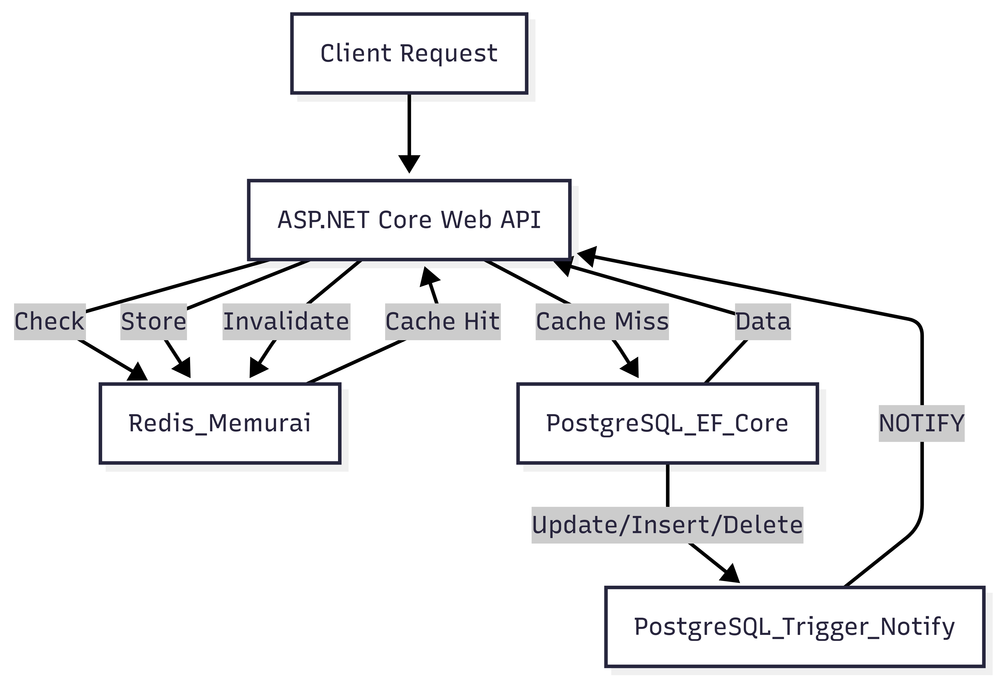

# ProductApiWithRedis

ASP.NET Core 8 Web API using PostgreSQL and Redis (Memurai-compatible) for local Windows development.

## Features

- PostgreSQL with EF Core
- Redis caching using StackExchange.Redis
- Cache invalidation via PostgreSQL LISTEN/NOTIFY
- Swagger UI

## Architecture Diagram



## Setup Instructions

### Prerequisites

- .NET 8 SDK
- PostgreSQL for Windows
- Memurai Redis for Windows

### PostgreSQL Setup

1. Create database and table:

```sql
CREATE DATABASE productdb;

CREATE TABLE public."Products" (
    "Id" SERIAL PRIMARY KEY,
    "Name" TEXT NOT NULL,
    "Price" DECIMAL NOT NULL
);
```

2. Create trigger and function:

```sql
CREATE OR REPLACE FUNCTION notify_product_update()
RETURNS TRIGGER AS $$
BEGIN
  PERFORM pg_notify('product_updated', NEW."Id"::text);
  RETURN NEW;
END;
$$ LANGUAGE plpgsql;

CREATE TRIGGER product_update_trigger
AFTER UPDATE ON "Products"
FOR EACH ROW EXECUTE FUNCTION notify_product_update();
```

### Redis Setup

- Install and run Memurai on localhost:6379.

### Run the App

```bash
dotnet restore
dotnet run
```

### Test

- Swagger: `http://localhost:5000/swagger`
